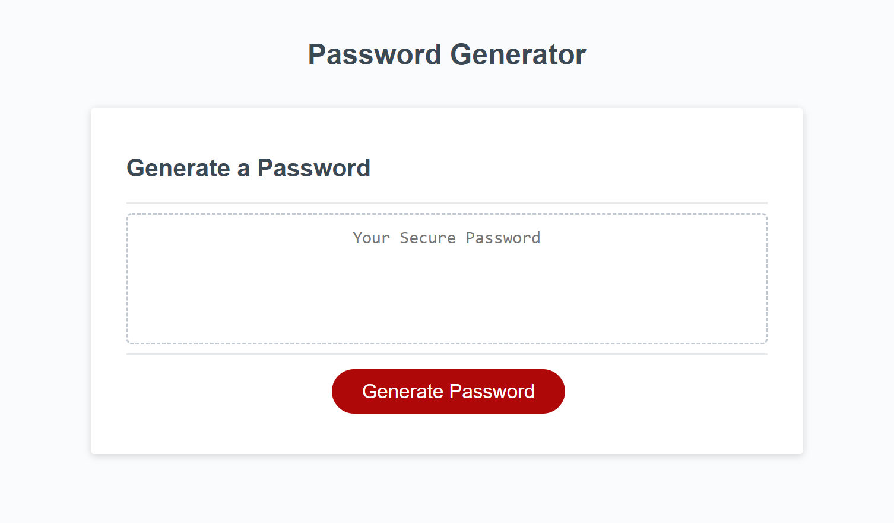

# Password Generator
Password Generator is a website that can generate a password from 8 - 128 characters based on the user's chosen criteria. The criteria includes lowercase letters, uppercase letters, numbers, and special characters.

## Files and Directories
There is a gitignore file. The javascript and css files can be found in the root of the directory.

## Publishing
The website is published using github pages.

## Link to application
[Click here to visit Password Generator](https://mymy-4242.github.io/password-generator-challenge3/)